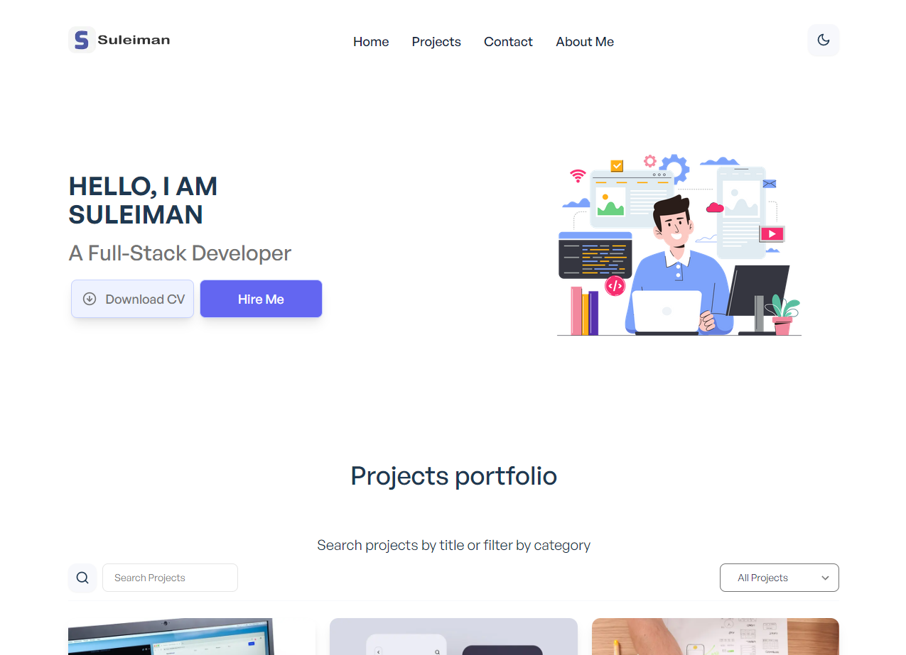

# Next.js Portfolio

A simple portfolio starter theme built with Next.js and Tailwind CSS.




https://github.com/Suleiman700/NextJS-Portfolio/assets/25286081/6414bcaa-650b-4e49-b550-4807af7a757e


## Features

-   Built with [Next.js](https://nextjs.org)
-   [Tailwind CSS v3](https://tailwindcss.com)
-   Download file button
-   Projects filter by category
-   Projects filter by search
-   Dark Mode
-   Smooth scroll
-   Counter
-   Dynamic forms
-   Back to top button
-   Simple and responsive design
-   Reusable Components
-   Framer Motion Transitions & Animations
-   Custom Hooks

## Setup

1. Make sure you have Node JS installed. If you don't have it:

-   [Download it from nodejs.org](https://nodejs.org)
-   [Install it using NVM ](https://github.com/nvm-sh/nvm)
-   If you're on Mac, Homebrew is a good option too:

1. Install packages and dependencies:

```
npm install
```

2Start a local dev server at `http://localhost:3000`:

```
npm run dev
```
